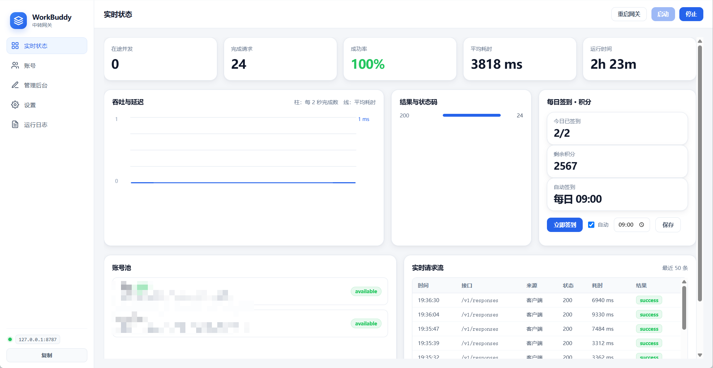
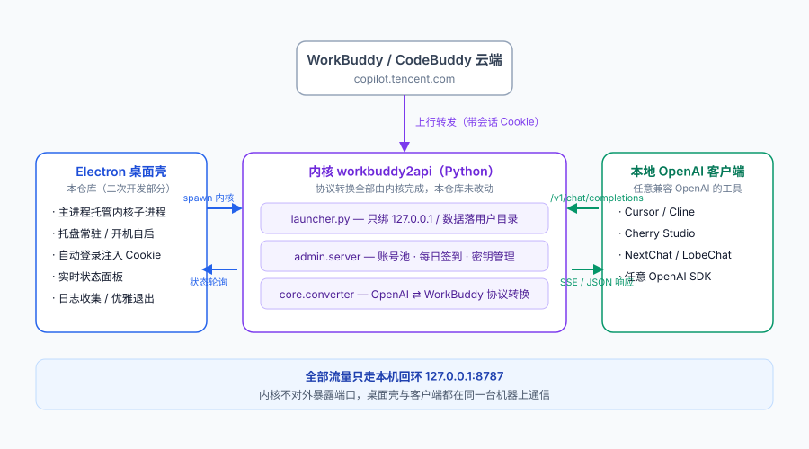

# WorkBuddy 中转网关 · 桌面版

> **本仓库是 `workbuddy2api` 的二开（二次开发）桌面项目**，不是协议转换的原始实现。
> 协议转换、账号池、签到等能力全部来自内核，本仓库只提供 Electron 桌面外壳。

把 `workbuddy2api` 内核装进一个原生 Windows 窗口：托盘常驻、开机自启、实时看中转状态，不用再开着一个命令行窗口。

## 下载

👉 **[从 Releases 下载](https://github.com/QuanshuYang05/codebuddy-gateway/releases/latest)**

当前版本 **v0.1.2**，GitHub Actions 在每次打 `v*` tag 时自动构建三平台产物并挂到对应 Release：

| 平台 | 文件 | 说明 |
|---|---|---|
| Windows | `codebuddy-gateway-0.1.2-Setup.exe` | NSIS 用户级安装，约 116 MB |
| macOS（Apple Silicon） | `codebuddy-gateway-0.1.2-arm64.dmg` / `-arm64.zip` | 仅 arm64；**未做开发者签名**，首次打开需在「访达」里右键 → 打开 |
| Linux | `codebuddy-gateway-0.1.2-x86_64.AppImage` / `-amd64.deb` | AppImage 需先 `chmod +x` |

## 项目来源与分工

这是一个**二次开发项目**，代码分两层，职责边界很清楚：

| 层 | 内容 | 来源 |
|---|---|---|
| **桌面外壳（本仓库）** | Electron 主进程 / 渲染界面 / Python 启动器 / 打包脚本 | 本仓库原创，`src/`、`scripts/`、`resources/` |
| **内核 `workbuddy2api`** | 协议转换、账号池、OAuth 登录、积分签到、管理后台 API | **第三方项目，非本仓库原创**，仅随安装包分发 |

内核自身的演进关系（见其 README 与 LICENSE）：

```
HanHan666666/codebuddy2openai   （原始思路与实现）
        ↓ 演进
   workbuddy2api                （本桌面版内置的内核，新增管理层 / 账号池 / 签到 / /responses 兼容）
        ↓ 二次开发
   codebuddy-gateway            （本仓库：Electron 桌面壳 + 打包分发）
```

**协议转换一行都没改，全部由内核提供。** 桌面壳只负责四件事：

1. 以子进程方式托管内核，**只绑定 127.0.0.1**
2. 用本地保存的管理密钥自动登录，把会话 Cookie 注入窗口，打开就是已登录状态
3. 托盘常驻，实时显示中转状态（轮询内核 `/admin/api/overview`）
4. 开机自启、日志收集、优雅退出

## 界面与架构

### 主界面



左侧是导航，中间是实时状态（在途并发、完成请求、成功率、平均耗时、运行时间、吞吐与延迟、账号池、每日签到、实时请求流）。

### 架构图



- **Electron 桌面壳**（本仓库）：进程托管、自动登录、托盘、实时状态面板、打包分发
- **内核 `workbuddy2api`**（第三方）：协议转换、账号池、OAuth 登录、积分签到、管理后台
- **本地 OpenAI 客户端**：Cursor / Cherry Studio / Cline / Codex 等，全部走 `http://127.0.0.1:8787/v1`
- **WorkBuddy 云端**：上行转发，桌面壳负责把会话 Cookie 注入内核

内核接口保持不变：

| 接口 | 用途 |
|---|---|
| `/v1/chat/completions` | Cherry Studio / HexHub / LobeChat 等 OpenAI 客户端 |
| `/v1/responses` | Codex CLI |
| `/v1/messages` | Claude Code / CC Switch |
| `/v1/models` | 模型列表 |
| `/admin/` | 管理后台（账号池、API Key、浏览器授权登录） |

---

## 安装

### 方式一：下载安装包（推荐）

从本仓库的 [Releases](../../releases) 页面下载 `codebuddy-gateway-<版本>-Setup.exe`（约 110MB），双击安装。

- 默认装到当前用户目录，**不需要管理员权限**
- 可选创建桌面 / 开始菜单快捷方式
- 安装包**自带 Python 内核**（`resources/kernel`，含 `.venv`），装完即用，机器上不必预装 Python

### 方式二：从源码运行

需要 Node.js 与内核的 Python `.venv`。

```bash
npm install
npm start
```

> **踩过的坑**：直接用 `electron .` 会启动失败。WorkBuddy、VS Code 这类 Electron 宿主
> 会往环境里注入 `ELECTRON_RUN_AS_NODE=1`，带着它启动时 electron 会以纯 Node 模式运行，
> `require('electron')` 返回 `undefined`，主进程第一行就崩；又因为它是 Windows GUI 子系统
> 程序，错误不会打印到控制台，表现为「双击没反应」。`scripts/start.js` 会先删掉这个变量再启动。

关闭窗口**不会退出**，会缩到托盘继续中转；要彻底退出请用托盘菜单里的「退出」。

---

## 客户端接入

在 HexHub / Claude Code / Codex / Cherry Studio 里填：

- **API 地址**：`http://127.0.0.1:8787/v1`
- **API Key**：设置页里的「客户端 Key」，首次运行自动生成（形如 `wbg-xxxx`），可复制可改

内核对 `/v1/*` 强制校验 Key，留空会导致客户端 401。这一点是实测踩出来的，所以桌面版改成自动生成。

---

## 界面

- **启动页**：圆角卡片 + Logo 脉冲动画 + 跳动加载点，持续约 1.6 秒后淡入主窗口
- **实时状态**：左侧导航、右侧 KPI 卡片、吞吐延迟折线图、状态码分布、账号池、请求流
- **每日签到**：见下节
- **账号页**：见下节
- **管理后台**：以 webview 内嵌内核自带后台（已自动登录）
- **设置**：内核目录、端口、客户端 Key、开机自启
- **日志**：内核进程输出

界面风格参考了 [CC Switch](https://github.com/farion1231/cc-switch)：浅色背景、圆角大卡片、柔和阴影、侧边导航、蓝色主按钮。

---

## 与直接跑 `python -m admin.server` 的差异

| 项 | 原入口 | 桌面版 |
|---|---|---|
| 监听地址 | `0.0.0.0`（局域网可见） | `127.0.0.1`（仅本机） |
| 会话 Cookie | `secure=True`，本地 HTTP 下登不进 | `secure_cookie=False` |
| 数据目录 | `/data/management`、`/data/auth`（Linux 容器路径，Windows 不存在） | 用户目录 |
| 凭据 | 需手动放 `.info` | 首次启动自动从桌面端导入 |
| 登录 | 手动输管理密钥 | 自动登录 |

---

## 多账号：登录 / 切换 / 签到

账号池能力同样由内核提供（`admin/pool.py` + `admin/browser_login.py`），桌面版做的是把
`routing` 调度、OAuth 登录、逐账号操作搬到界面上。

### 积分消耗方式

内核 `pool.routing` 有两个值，决定请求扣谁的分：

| 模式 | 行为 |
|---|---|
| `round_robin` 轮询分摊（默认） | 所有「可用」账号轮流消耗，额度耗尽或冷却的自动跳过 |
| `manual` 手动指定 | 只走标为「当前」的那一个账号 |

点账号行上的**「只用此账号」**会一次做完三件事：启用该账号 → 设为当前 → 把调度切成 `manual`。
之所以连 `routing` 一起改，是因为轮询模式下「当前账号」不生效，只设 active 会出现「点了没变化」。
想恢复分摊，把上面选回「轮询分摊」即可。

### 添加账号

1. **浏览器登录新账号**（推荐）：点按钮后会在默认浏览器打开一次性授权页，
   界面每 3 秒轮询一次，登录成功自动完成绑定。链接 5 分钟过期，可取消。
   走系统浏览器是为了复用你已有的 CodeBuddy 会话，不必在应用里再实现一套登录。
2. **导入登录文件**：选择桌面端导出的 `.info` 文件。

> **导入的坑**：新版桌面端会把令牌**加密**存储（`auth.accessToken` 是
> `{$wbEncrypted:1, envelope:"..."}` 对象而非字符串），内核只认明文，直接导入会报
> 「凭据缺少 accessToken」。桌面版会提前识别并提示改用同目录下**带时间戳的备份文件**
> （形如 `workbuddy-desktop.2026-09-20T13-05-32-071Z.*.info`，里面是明文）。

### 逐账号操作

每个账号一行，带：只用此账号 / 签到 / 刷新（刷新令牌与积分）/ 启用停用 / 删除。
删除会把凭据移入内核的 `trash/` 目录而非直接销毁。

---

## 每日签到与积分

签到能力**本来就在内核里**（`admin/pool.py`），桌面版只是把它暴露到界面上，没改动任何签到逻辑。

状态页新增「每日签到 · 积分」面板：

- **今日已签到** `x/y`、`剩余积分合计`、`自动签到` 时间
- **立即签到（全部账号）** 按钮，逐个账号返回 `成功 / 今日已签到，无需重复签到 / 没有可参与的活动 / 失败原因`
- **自动签到开关 + 时间**（北京时间，`HH:MM`），走内核 `pool.settings`
- 托盘菜单也有「每日签到（立即）」，完成后弹桌面通知
- 账号池每行会显示「今日已签到 / 今日未签到」

几点需要知道：

- **签到只支持国内账号**。域名为 `workbuddy.ai` 的账号内核会直接返回「当前仅支持国内账号积分与签到」。
- **自动签到依赖内核 tick**，逻辑是「当前时间 ≥ 设定时间就签」，不是精确到秒的定时任务，
  到达设定时间后会在下一个同步周期（约 5 分钟内）执行。**应用必须处于运行状态**。
- 每次签到都会顺带刷新积分余额，所以手动点一次也能更新积分显示。
- 签到是幂等的，重复调用只返回「今日已签到，无需重复签到」，不会重复领。

---

## 文件结构

```
src/
  launcher.py            Python 启动器（回环绑定、目录处理、凭据导入）
  electron/
    main.js              主进程：进程托管、自动登录、托盘、开机自启、多账号与签到
    preload.js           contextBridge，向渲染层暴露 gw.*
  renderer/
    index.html / app.js / styles.css    控制台界面
resources/               图标（icon.ico / icon.png / tray.png）
scripts/
  start.js               启动入口（处理 ELECTRON_RUN_AS_NODE）
  smoke-test.js          内核链路冒烟测试
  build.js               打包：复制内核 + 设置镜像 + 调用 electron-builder
```

> `build/kernel/`（Python 内核副本，含 `.venv`）与 `release*/`（安装包产物）均由打包脚本生成，
> 已排除在版本控制之外。

---

## 打包成安装包

```bash
npm run build     # 等价于 npm run dist，产出 Windows NSIS 安装包
```

产物：`release/codebuddy-gateway-<版本>-Setup.exe`。

打包脚本会处理三件事：

1. 把内核目录复制到 `build/kernel`（排除 `__pycache__` / `.pyc` / 日志）
2. 设置 `ELECTRON_MIRROR` 与 `ELECTRON_BUILDER_BINARIES_MIRROR` 走国内镜像，
   否则 GitHub 下载会超时
3. 关闭宿主给 `fs.rm` 挂的批量删除保护（仅作用于构建子进程，
   删除目标是本项目自己生成的构建产物）

换内核目录：

```bash
KERNEL_DIR=D:\path\to\workbuddy2api npm run build
```

### 打包版与开发版的三处差异

| 位置 | 开发版 | 打包版 |
|---|---|---|
| 内核目录 | `DEFAULT_PROJECT` 常量（`src/electron/main.js`） | `resources/kernel`（随包附带） |
| `launcher.py` | `src/launcher.py` | `resources/launcher.py`（不能留在 asar 内，Python 读不到） |
| 图标 | `resources/` | `resources/`（extraResources） |

若用户手动改过设置页的内核目录，则始终尊重用户的选择。

---

## 冒烟测试

不启动 Electron，直接验证内核链路：

```bash
npm run smoke
```

会依次检查：内核启动 → `/health` → 管理端登录 → `/admin/api/overview` → 账号池 →
`/v1/models` → 真实转发一次 `/v1/chat/completions` → 指标递增。

---

## 已知限制

- **指标是进程内累计**，重启内核即清零——这是内核 `admin/metrics.py` 的设计（不落盘请求正文），非桌面版缺陷。
- 端口默认 8787，若被占用需先在设置页改端口再启动。
- 内核依赖本机 CodeBuddy 桌面端的登录态；凭据过期后需用管理后台重新导入或走浏览器授权登录。
- 账号上限 100 个、API Key 上限 100 枚（内核限制）。
- 安装包体积约 110MB，主要来自内置 Python 内核与 Electron 运行时。

---

## 许可与署名

本仓库自带的**桌面外壳代码**（`src/`、`scripts/`、`resources/`、`docs/`）采用 **MIT License**（见根目录 `LICENSE`）。

随安装包分发的内核 `workbuddy2api` 使用其自身的 **MIT License**（Copyright © 2026 HanHan666666、Copyright © 2026 Chris），
其思路演进自 [HanHan666666/codebuddy2openai](https://github.com/HanHan666666/codebuddy2openai)。
内核自身的许可条款以该内核目录下的 `LICENSE` 为准，本仓库不对其主张任何权利。

---

## 免责声明

本项目仅是对 WorkBuddy / CodeBuddy **本机登录态**的协议转换与界面封装，不提供任何账号、不中转任何第三方密钥，
所有请求均在本机完成。请遵守你与 WorkBuddy / CodeBuddy 之间的服务条款，因使用本项目产生的任何后果由使用者自行承担。
